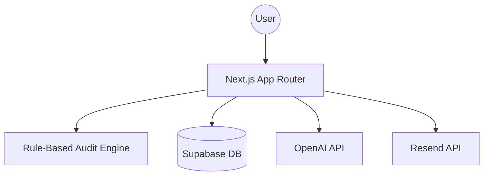

# Architecture Documentation

## System Overview
The application follows a modern Serverless architecture using Next.js 15.

## Core Components
1. **Audit Engine (`/lib/audit-engine.ts`)**: Pure functions that apply financial rules to input data. Deterministic and testable.
2. **Dynamic Form**: Built with `react-hook-form` and `zod` for real-time validation and local storage persistence.
3. **API Routes**:
    - `/api/audit`: Processes and persists audit results.
    - `/api/summary`: Triggers OpenAI for qualitative analysis.
    - `/api/lead`: Handles lead capture and transactional emails.

## Data Flow
1. User enters data into the client-side form.
2. Data is validated and sent to the internal Audit Engine.
3. Results are returned to the UI and simultaneously saved to Supabase via a server-side route.
4. OpenAI generates a summary in the background once the results page loads.
5. If the user provides an email, a lead record is created and linked to the audit.

## Scalability
- **Compute**: Next.js on Vercel scales horizontally.
- **Database**: Supabase (PostgreSQL) handles relational data with RLS for security.
- **State**: Critical audit data is passed via sessionStorage and Supabase IDs to maintain speed and shareability.
